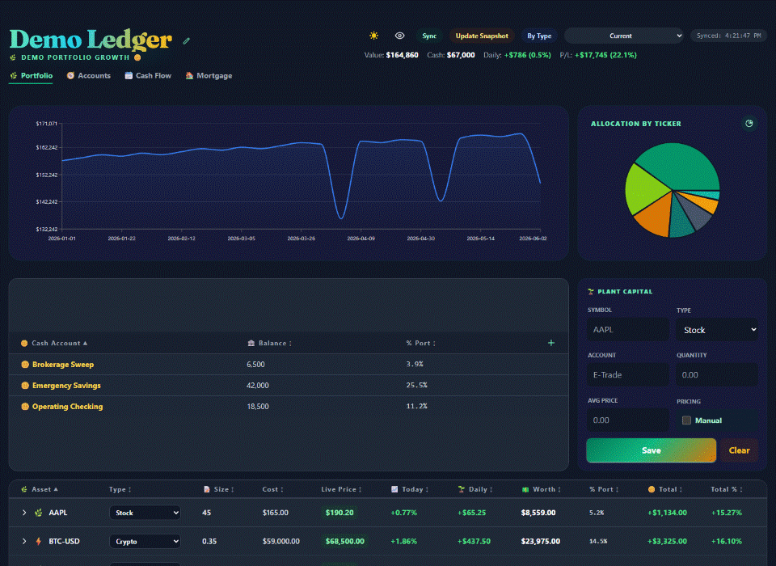

# Lite Tracker

Lite Tracker is a local-first finance tracker for portfolio, accounts, cash flow, and mortgage planning. It runs on your computer with a FastAPI backend, a React frontend, and a local SQLite database.

## Demo Preview

[](app/demo/assets/demo-preview.gif)

The preview uses fake demo data. Click it to replay the GIF.

Screenshots:
[Portfolio](app/demo/assets/portfolio.png) |
[Accounts](app/demo/assets/accounts.png) |
[Cash Flow](app/demo/assets/cash-flow.png) |
[Mortgage](app/demo/assets/mortgage.png)

## Requirements

- Python 3.11 or newer
- Node.js 20 LTS or newer
- Git

Check versions:

```bash
python --version
node --version
npm --version
```

On macOS/Linux, use `python3` if `python` is not available.

## Quick Start

Run the setup helper from the repo root.

Windows:

```powershell
py -3 setup_app.py
```

macOS/Linux:

```bash
python3 setup_app.py
```

The helper creates `.venv`, installs Python and frontend dependencies, initializes `lite-tracker.db`, builds the React app, and starts the local server.

Open:

```text
http://127.0.0.1:8000
```

Stop the app with `Ctrl+C`.

If `.venv` already exists, the helper stops and asks you to remove or rename it yourself. It also stops if you run it from inside an active virtual environment.

## Demo Mode

Use demo mode to try the app with fake data:

Windows:

```powershell
py -3 setup_app.py --demo
```

macOS/Linux:

```bash
python3 setup_app.py --demo
```

If dependencies are already installed:

```bash
python main.py --demo
```

Demo mode creates `demo-lite-tracker.db` and starts the app with `LITE_TRACKER_DB_PATH` pointing to that file. Your real `lite-tracker.db` is not changed.

To return to the real local database:

```bash
python main.py
```

If you previously set `LITE_TRACKER_DB_PATH` manually, clear it first:

PowerShell:

```powershell
Remove-Item Env:LITE_TRACKER_DB_PATH
```

Command Prompt:

```cmd
set LITE_TRACKER_DB_PATH=
```

macOS/Linux:

```bash
unset LITE_TRACKER_DB_PATH
```

## Using The App

- Portfolio: add live-priced holdings, manual/private holdings, cash accounts, asset types, snapshots, and live price sync.
- Accounts: view holdings grouped by account.
- Cash Flow: schedule payments/income, manage recurring flows, settle/unsettle items, and edit cash balances.
- Mortgage: view property estimate, equity, loan terms, payoff projection, and principal impact from settled mortgage payments.
- Privacy: use the eye button to hide numeric values on screen.
- Branding: edit the app name from the header.

## Data And Backups

The real local database is `lite-tracker.db` in the repo root. It is ignored by git.

To move data to another computer:

1. Run setup once on the new computer.
2. Stop the app.
3. Replace the new `lite-tracker.db` with your backup copy.
4. Start the app again with `python main.py`.

Back up `lite-tracker.db` regularly.

## Manual Setup

Use this only if `setup_app.py` fails.

Create and activate a virtual environment.

Windows:

```powershell
py -3 -m venv .venv
.\.venv\Scripts\Activate.ps1
```

macOS/Linux:

```bash
python3 -m venv .venv
source .venv/bin/activate
```

Install dependencies, initialize the database, build, and start:

```bash
python -m pip install --upgrade pip
python -m pip install -r requirements.txt
npm install
python -c "from app.db.session import Base, engine; from app.db import models; Base.metadata.create_all(bind=engine)"
npm run build
python main.py
```

## Checks

Run tests:

```bash
python -m pytest tests -q
```

Current baseline: `85 passed`.

If Windows cannot access the default pytest temp directory:

```powershell
New-Item -ItemType Directory -Force .tmp\pytest | Out-Null
$env:TMP = "$PWD\.tmp\pytest"
$env:TEMP = "$PWD\.tmp\pytest"
python -m pytest tests -q
```

Rebuild the frontend after UI changes:

```bash
npm run build
```

## Troubleshooting

- `npm` or `node` not found: install Node.js, open a new terminal, then check `node --version` and `npm --version`.
- Frontend not updating: run `npm run build` and hard refresh the browser.
- Port `8000` in use: stop the existing process or run the app on another port with uvicorn.
- Test dependency issues: run `python -m pip install -r requirements.txt`.

## Agent Documentation

For AI agents working in this repo, start with [AGENTS.md](AGENTS.md). Optional local agent skills can live under `.skills/`, which is ignored by git.
